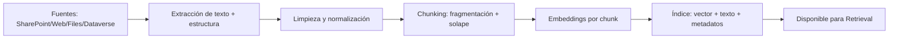

# Sesión 1.2 — Proceso de indexación documental

> **Bloque**: Sesión 1 — *Fundamentos operativos de RAG y su aplicación inicial en Copilot Studio*  
>> **Objetivo**: que el alumnado entienda y pueda diseñar un pipeline de indexación *robusto* (ingesta → chunking → embeddings → almacenamiento + metadatos).

---

## 0) Objetivos de aprendizaje del bloque

Al finalizar este bloque, el participante será capaz de:

1. Describir las fases de un pipeline de **ingesta e indexación** para RAG.
2. Diseñar una estrategia de **chunking** (criterios, solape, contexto) y justificarla.
3. Entender cómo el chunking afecta **precisión** y **recall**.
4. Definir un esquema de **metadatos** útil para filtrado, permisos y control de versiones.
5. Reconocer los riesgos comunes: duplicados, PDFs “mal extraídos”, tablas, y contenido sensible.


---

## 2) Visión general: pipeline de indexación para RAG

Un pipeline “mínimo viable” para RAG suele tener estas etapas:



### 2.1 ¿Qué sale de la indexación?

Para cada *chunk* (fragmento) deberías terminar con algo como:

- `chunk_id` (único)
- `doc_id` (estable)
- `version_id` (o `last_modified`)
- `chunk_text` (texto “recuperable”)
- `embedding` (vector)
- `metadata` (diccionario: título, sección, permisos, tags, fecha, URL…)

**Regla de oro**: *la unidad de recuperación es el chunk, no el documento completo.*

---

## 3) Ingesta de documentos (ingestion)

### 3.1 Tipos de fuentes habituales (empresa)

- Repositorios documentales: SharePoint / OneDrive / Teams
- Bases internas: Dataverse / repositorios de conocimiento / wikis
- Web corporativa (páginas estáticas, bases de conocimiento públicas)
- PDFs y ofimática (DOCX, PPTX, etc.)
- Sistemas externos vía conectores

### 3.2 Sub‑pasos de ingesta (qué ocurre “entre bambalinas”)

1. **Descubrimiento / enumeración**
   - Listar URLs, rutas, carpetas o registros.
   - Capturar metadatos disponibles (autor, fecha, etiquetas, permisos).

2. **Extracción**
   - Convertir a texto:  
     - PDF: texto embebido vs imagen escaneada  
     - DOCX/PPTX: texto estructurado
   - Extraer estructura: títulos, encabezados, listas, tablas.

3. **Normalización**
   - Unificar codificación, eliminar caracteres invisibles.
   - Corregir saltos de línea “rotos”, guiones al final de línea, etc.
   - Detectar idioma (útil para embeddings y filtros).

4. **Enriquecimiento opcional**
   - Clasificación temática.
   - Detección de PII/sensibilidad.
   - Resúmenes por sección.
   - “Keyphrases” para búsqueda léxica.

5. **Control de duplicados**
   - Hash del contenido.
   - Dedupe por URL + timestamp.
   - Estrategias de “latest wins”.

---

## 4) Chunking: fragmentación con intención

### 4.1 ¿Qué es un chunk (en RAG)?

Un **chunk** es un fragmento de contenido diseñado para:

- ser **recuperado** (retrieval),
- caber en el **contexto** del LLM,
- mantener **coherencia semántica**,
- ser **citable** (idealmente con referencia a sección/página).

> Importante: chunking no es “cortar texto por cortar”; es **diseñar unidades informacionales recuperables**.

---

### 4.2 Criterios de fragmentación (estrategias)

#### A) Tamaño fijo (por caracteres / tokens)
- **Cómo funciona**: cada N tokens se crea un chunk.
- **Pros**: simple, rápido.
- **Contras**: rompe ideas a mitad, mezcla temas, empeora citaciones.
- **Útil cuando**: contenido muy homogéneo (FAQ, textos cortos).

#### B) Por estructura (títulos, secciones, Markdown, HTML headings)
- **Cómo funciona**: respeta jerarquía (H1/H2/H3), listas, párrafos.
- **Pros**: chunks más “humanos”, mejores citaciones.
- **Contras**: algunas secciones pueden quedar enormes (hay que recortar).
- **Útil cuando**: manuales, políticas, wikis, documentación.

#### C) “Recursive chunking” (jerárquico)
- **Cómo funciona**: intenta dividir por separadores (\n\n, frases, etc.) hasta llegar al tamaño objetivo.
- **Pros**: preserva semántica mejor que tamaño fijo.
- **Contras**: necesita tuning.

#### D) Chunking semántico
- **Cómo funciona**: detecta cambios de tema y corta donde tiene sentido.
- **Pros**: mejora precisión y reduce “mezcla” de temas.
- **Contras**: más complejo; puede ser inestable con textos ruidosos.
- **Útil cuando**: documentos largos con secciones densas y temas alternantes.

#### E) Chunking específico por tipo de contenido
- **Tablas**:  
  - Opción 1: convertir a texto (fila a fila) con cabecera repetida  
  - Opción 2: mantener estructura (JSON/CSV) y recuperar como bloque
- **Código**: mantener funciones/bloques completos.
- **PPT**: agrupar por diapositiva.
- **PDF**: por página o por sección detectada (si hay índices).

---

### 4.3 Tamaño del chunk: guía práctica

No hay “número mágico”, pero hay patrones:

- **Chunks pequeños** (p. ej., 100–250 tokens)
  - + alta precisión (menos ruido)
  - – puede perder contexto (respuestas incompletas)
  - – más costos de indexación (más chunks)

- **Chunks medianos** (p. ej., 250–600 tokens)
  - balance típico: suficiente contexto sin mezclar temas

- **Chunks grandes** (p. ej., 800–1500+ tokens)
  - + más contexto
  - – baja precisión (mezcla temas)
  - – el modelo puede “resumir de más” y omitir detalles
  - – citaciones menos útiles (“todo el documento”)

> **Regla de diseño**: un chunk debería poder responder *una pregunta típica* sin necesitar el documento completo.

---

### 4.4 Solape (overlap) y contexto

**¿Qué es el solape?**  
Repetir parte del contenido entre chunks consecutivos para no perder continuidad.

- Ejemplo: si tu chunk tiene 400 tokens y usas 80 tokens de solape:
  - Chunk 1: tokens 1–400
  - Chunk 2: tokens 321–720 (solape 321–400)

**Pros del solape**
- Reduce pérdida de contexto cuando una idea se parte entre chunks.
- Mejora preguntas que se apoyan en 2 párrafos consecutivos.

**Contras del solape**
- Aumenta duplicidad: el retriever puede traer dos chunks casi iguales.
- Aumenta coste de almacenamiento.
- Puede sesgar el ranking (mismo contenido duplicado compite consigo mismo).

**Guía de solape**
- 10–20% suele funcionar como punto de partida.
- Si el contenido tiene párrafos largos o definiciones con excepciones, subir overlap.
- Si hay mucho contenido repetitivo, bajar overlap o usar dedupe por similitud.

---

### 4.5 Chunking y citaciones: relación directa

Para que una citación sea útil, el chunk debe ser:

- **trazable**: saber de qué doc y sección viene,
- **localizable**: tener `ContentLocation` o URL/página,
- **específico**: referir a un trozo concreto, no a 30 páginas.

> Si el chunk es demasiado grande, la citación deja de ser evidencia; se convierte en “te mando al documento”.

---

## 5) Impacto del chunking en precisión y recall

### 5.1 Definiciones operativas rápidas

- **Precision**: de lo recuperado, ¿cuánto es relevante?
- **Recall**: de lo relevante, ¿cuánto recupero?

### 5.2 Cómo influye el chunking (intuición)

- Chunks **más pequeños** → ↑ precision, ↓ recall (si el contexto está repartido)
- Chunks **más grandes** → ↑ recall, ↓ precision (mezcla temas)

### 5.3 Síntomas típicos y diagnóstico

**Síntoma A**: el bot responde “correcto pero incompleto”  
- Probable causa: chunks demasiado pequeños o sin overlap suficiente.

**Síntoma B**: el bot se va por las ramas o mezcla políticas  
- Probable causa: chunks demasiado grandes o sin respeto por secciones.

**Síntoma C**: citaciones apuntan a fragmentos irrelevantes  
- Probable causa: chunking rompe estructura o falta de metadatos (sección, título).

---

## 6) Metadatos: filtrado, permisos y control

### 6.1 ¿Por qué metadatos?

En RAG empresarial, **muchas decisiones deben ocurrir antes del LLM**:
- filtrar por idioma,
- filtrar por país,
- filtrar por versión vigente,
- filtrar por permisos.

Esto se hace con metadatos.

### 6.2 Esquema recomendado de metadatos (mínimo)

**Identidad y trazabilidad**
- `doc_id` (estable)
- `source_system` (SharePoint, Web, Dataverse…)
- `source_url` (o ruta)
- `title`
- `section_path` (p. ej., `Política RRHH > Vacaciones > España`)
- `page_number` (si aplica)

**Versionado**
- `version_id` o `etag`
- `last_modified`
- `status` (draft/approved/published)
- `valid_from`, `valid_to` (si aplica)

**Seguridad**
- `acl` (lista de grupos/roles) o un atributo equivalente
- `classification` (public/internal/confidential)
- `sensitivity_label` (si tu ecosistema lo usa)

**Dominio**
- `department` (RRHH/IT/Legal…)
- `country` / `region`
- `product` / `process`

**Calidad**
- `extraction_quality` (alto/medio/bajo)
- `is_duplicate` (boolean)

### 6.3 Filtros típicos en retrieval

- “Solo documentos publicados”
- “Solo España”
- “Solo RRHH”
- “Solo clasificación Internal”
- “Excluir borradores”
- “Excluir duplicados”

> Importante: **filtrar bien reduce alucinación** porque reduces el espacio de posibles respuestas.

---

## 7) Actividad guiada (10–15 min): diseña chunks y metadatos

### Material (el instructor)
- Un documento real o simulado de 3–6 páginas:
  - política de vacaciones,
  - procedimiento de compras,
  - guía de IT.

### Paso 1 — Identificar estructura (2 min)
- Títulos, secciones, subsecciones.
- ¿Hay tablas? ¿listas? ¿excepciones?

### Paso 2 — Elegir estrategia de chunking (4 min)
- ¿Por secciones con límite máximo?
- ¿Recursivo con tamaño objetivo?

### Paso 3 — Definir solape (2 min)
- ¿Dónde es más probable que haya dependencia entre párrafos?

### Paso 4 — Definir metadatos (4–7 min)
- Completa esta tabla:

| Campo | Ejemplo | ¿Para qué sirve? |
|---|---|---|
| doc_id | POL-RRHH-07 | Identidad estable |
| version_id | v3.2 | Control de versiones |
| status | published | Evitar borradores |
| country | ES | Filtrar por país |
| section_path | Vacaciones > Devengo | Citación y navegación |
| source_url | (URL) | Trazabilidad |

---

## 8) Checklist final de calidad (para el alumno)

- [ ] Los chunks son coherentes (una idea / tema por chunk).
- [ ] Hay solape suficiente para no romper definiciones/excepciones.
- [ ] Los metadatos permiten filtrar por versión vigente.
- [ ] El esquema contempla permisos o al menos clasificación.
- [ ] La citación sería útil (puede llevarte al sitio correcto).
- [ ] Hay estrategia ante PDFs con mala extracción / tablas complejas.

---

## 9) Referencias técnicas (lectura opcional)

> **Nota**: URLs incluidas en bloque de código para fácil acceso.

```text
Azure AI Search — cómo y por qué “chunking”:
https://learn.microsoft.com/en-us/azure/search/vector-search-how-to-chunk-documents

Azure AI Search — semantic chunking por layout (document structure):
https://learn.microsoft.com/en-us/azure/search/search-how-to-semantic-chunking
```

