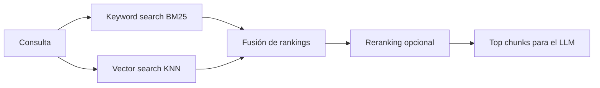

# Sesión 1.3 — Embeddings y recuperación semántica

> **Bloque**: Sesión 1 — *Fundamentos operativos de RAG y su aplicación inicial en Copilot Studio*  
> **Objetivo**: dominar los conceptos que explican *por qué* la recuperación funciona (y por qué falla), y cómo diseñar búsqueda semántica + híbrida en empresa.

---

## 0) Objetivos de aprendizaje del bloque

Al finalizar este bloque, el participante será capaz de:

1. Explicar qué son los **embeddings** y por qué permiten recuperación semántica.
2. Entender cómo se calcula la **similaridad** (coseno, dot product) y qué implica.
3. Identificar limitaciones de un enfoque **solo vectorial** (y síntomas en producción).
4. Describir el concepto y beneficios de la **búsqueda híbrida** (keyword + vector) y el rol del reranking.
5. Comprender qué es (y qué hace) una **base vectorial** (vector database / vector store) en un sistema RAG.


---

## 2) Representación vectorial del texto (embeddings)

### 2.1 Definición operativa

Un **embedding** es una representación numérica (vector) de un texto (o imagen, audio) tal que:

- textos con significado similar → vectores cercanos,
- textos diferentes → vectores más alejados.

En RAG, generamos embeddings de:
- **chunks** del conocimiento (offline, durante indexación),
- **la consulta** del usuario (online, en tiempo de pregunta).

Luego hacemos *nearest neighbor search*:
- buscamos qué chunks están “más cerca” del vector de la consulta.

---

### 2.2 Intuición (sin matemáticas)

Piensa en un mapa:
- cada chunk es un punto en un espacio de muchas dimensiones,
- la consulta es otro punto,
- buscamos los puntos más cercanos.

La “cercanía” es una proxy de “hablan de lo mismo”.

---

### 2.3 Propiedades importantes (y malentendidos comunes)

- **No es una base de datos de hechos.**  
  Un embedding no “guarda” hechos; guarda *patrones de significado*.

- **No garantiza exactitud.**  
  Recuperar semánticamente “parecido” no equivale a recuperar “correcto”.

- **Embeddings capturan contexto estadístico**, no necesariamente reglas formales.

- **Multilingüe**: muchos modelos colocan frases equivalentes en idiomas distintos relativamente cerca, pero no siempre.

---

## 3) Similaridad semántica (cómo se mide)

### 3.1 Métricas típicas

#### A) Similaridad coseno (cosine similarity)

Mide el ángulo entre vectores (su dirección), ignorando la magnitud:

\[
\text{cosine}(a,b) = \frac{a \cdot b}{||a|| \, ||b||}
\]

- Rango típico: -1 a 1 (en la práctica, suele estar cerca de 0 a 1).
- Muy usada cuando los embeddings están normalizados.

#### B) Producto punto (dot product)
\[
a \cdot b = \sum_i a_i b_i
\]
- Puede estar correlacionado con coseno si normalizas los vectores.
- A veces es la métrica nativa en motores vectoriales.

#### C) Distancia Euclídea
\[
||a-b||
\]
- Menos frecuente en algunos stacks, pero conceptualmente útil.

---

### 3.2 Ejercicio rápido (5 min)

Supón embeddings en 2D para entender el concepto:

- Consulta **q** = (1, 0)
- Chunk A = (0.9, 0.1)
- Chunk B = (-1, 0)
- Chunk C = (0.6, 0.8)

Preguntas:
1) ¿Cuál está más cerca semánticamente?  
2) ¿Por qué B es “opuesto”?  
3) ¿Qué le pasa a C (tiene magnitud alta en Y)?

> Objetivo didáctico: interiorizar que *la dirección* importa tanto o más que el tamaño.

---

## 4) Recuperación semántica: de “top‑k” a un retriever robusto

### 4.1 Top‑k retrieval (lo típico)

- Calculas embedding de la consulta.
- Pides los **k chunks** más similares.
- Los pasas al LLM como contexto.

**Problema**: top‑k a secas trae:
- duplicados (por overlap),
- chunks semánticamente “parecidos” pero no relevantes,
- chunks muy generales.

---

### 4.2 Umbral de score (score thresholding)

Además de top‑k, estableces un mínimo de similaridad:
- si el score < umbral → no usar chunk.

Beneficio:
- reduce “hallucination by retrieval noise”.

Riesgo:
- demasiado alto → no recuperas nada (abstención excesiva).

---

### 4.3 Diversidad: MMR (Maximal Marginal Relevance)

MMR intenta equilibrar:
- relevancia con la consulta
- diversidad entre chunks

Objetivo:
- evitar traer 5 chunks casi iguales.
- traer piezas complementarias.

---

### 4.4 Reranking (re‑ordenar resultados con “más inteligencia”)

Patrón:
1. Recuperación rápida (vector/keyword): top 50–200
2. Reranking “caro” pero preciso: quedarse con top 5–10

Tipos de reranking
- **Cross‑encoder** (más preciso, más costoso)
- **Semantic ranker** (cuando el motor lo ofrece)
- **LLM‑as‑reranker** (posible, pero cuidado con coste/latencia)

---

## 5) Bases vectoriales (vector stores) y su rol en RAG

### 5.1 ¿Qué es una base vectorial?

Una **base vectorial** (o vector store) es un sistema que:

- almacena vectores (embeddings) y su texto asociado,
- permite consultas tipo “dame los k vectores más cercanos”,
- soporta **filtrado por metadatos** (clave en enterprise),
- indexa eficientemente para búsqueda aproximada (ANN).

> No es solo “guardar arrays”; es soportar búsquedas de similitud a escala, con filtros y baja latencia.

---

### 5.2 ¿Qué se guarda exactamente?

Por cada chunk:

- `id`
- `embedding` (vector d‑dimensional)
- `text` (o referencia)
- `metadata` (doc_id, versión, permisos, URL, sección, etiquetas…)

Y, en sistemas híbridos:
- campos de texto para BM25/keyword
- campos de vectores para KNN

---

### 5.3 Índices vectoriales y ANN (alta escala)

Buscar el vecino más cercano exacto es caro si hay millones de chunks.

Por eso se usan algoritmos ANN, como:
- **HNSW** (Hierarchical Navigable Small World)
- **IVF / PQ** (en otros motores)

Tradeoff:
- más velocidad ↔ menos exactitud (aproximación)
- tuning de parámetros (efSearch, M, etc.) según motor

> Punto clave para clase: un resultado “casi el vecino más cercano” suele ser suficiente para RAG, porque luego hay reranking y el LLM sintetiza.

---

### 5.4 Filtrado por metadatos (imprescindible en empresa)

Ejemplos:
- `department = "RRHH"`
- `country = "ES"`
- `status = "published"`
- `classification in ("internal","public")`
- `acl contains "group:HR-Managers"`

**Orden recomendado**:
1) filtrar por metadatos → reduce universo
2) hacer KNN/keyword → rankear dentro del universo válido

---

### 5.5 Operación: actualizaciones, borrados y versionado

Cosas que rompen sistemas en producción:
- Reindexar sin borrar versiones antiguas → respuestas con mezcla de versiones.
- Duplicar documentos (mismo contenido con distinta URL) → retriever devuelve ambos.
- No tener `doc_id` estable → no puedes “latest‑only retrieval”.

Patrones de operación
- **Soft delete** + reindex incremental
- **Upsert por doc_id + version_id**
- Métrica de “drift”: ¿cuántos chunks antiguos siguen apareciendo?

---

## 6) Limitaciones del enfoque exclusivamente vectorial

### 6.1 Casos donde el vector‑only falla (muy frecuente)

1. **Búsqueda exacta / literal**
   - “¿Cuál es el código del procedimiento?”  
   - “¿Qué dice exactamente el punto 4.2.1?”

2. **Números, fechas, identificadores**
   - embeddings tienden a “suavizar” números y códigos.
   - se confunden “2023” vs “2024” si el texto alrededor es parecido.

3. **Acrónimos internos y jerga**
   - si el modelo no los conoce, los representa pobremente.

4. **Polisemia**
   - “baja” (médica) vs “baja” (reducción)  
   - vector puede mezclar sentidos si el contexto es escaso.

5. **Documentos muy largos con muchas secciones**
   - si chunking mezcla temas, el vector recupera “aproximado”.

6. **Recuperación de “la excepción”**
   - los embeddings suelen priorizar el tema principal, no el matiz/condición.

---

### 6.2 Mitigaciones (sin cambiar de herramienta)

- Mejor chunking (por estructura, semántico).
- Metadatos + filtros.
- Umbral de score + abstención (“no lo sé”).
- Top‑k mayor + reranking.
- Añadir keyword search (→ híbrida).

---

## 7) Concepto de búsqueda híbrida (keyword + vector)

### 7.1 ¿Qué resuelve la búsqueda híbrida?

Combina:
- **búsqueda léxica** (keyword/BM25): exactitud con términos
- **búsqueda vectorial**: semántica y sinónimos

Luego fusiona resultados y reordena.

**Beneficios**
- mejora recall semántico (vectores) + precisión literal (keywords)
- robusta con códigos y nombres propios
- reduce casos de “recuperé algo parecido pero no era eso”

---

### 7.2 Esquema de funcionamiento



---

### 7.3 Nota importante: híbrida ≠ “mezclar todo sin control”

Si no filtras por metadatos, la híbrida puede traer:
- resultados de dominios fuera de scope,
- versiones antiguas con matching literal,
- contenido que el usuario no debería ver.

Por eso, **híbrida + filtros** suele ser el estándar enterprise.

---

## 8) Cómo se conecta esto con Copilot Studio (idea operativa)

Cuando un producto enterprise implementa RAG, suele incluir:
- reescritura de la consulta (para mejorar retrieval),
- recuperación (con el motor elegido),
- generación/síntesis,
- validación de seguridad y gobierno.

Esto explica por qué a veces el sistema “reformula” tu pregunta antes de buscar: está intentando mejorar precisión y reducir ruido.

---

## 9) Checklist final de diseño (lo que el alumno debería llevarse)

**Embeddings**
- [ ] Modelo adecuado al idioma y dominio.
- [ ] Normalización consistente (si aplica).
- [ ] Estrategia para jerga y acrónimos (glosario/metadata/keyword).

**Retrieval**
- [ ] Top‑k inicial + reranking.
- [ ] Umbral de score y/o abstención.
- [ ] MMR para diversidad.

**Vector store**
- [ ] Filtrado por metadatos antes de rankear.
- [ ] Gestión de versiones y borrados.
- [ ] Capacidad de auditoría (qué chunks se devolvieron).

**Híbrida**
- [ ] Se activa si hay códigos, nombres propios, requerimiento literal o baja calidad semántica.
- [ ] Se combina con filtros de seguridad/alcance.

---

## 10) Referencias técnicas (lectura opcional)

```text
Azure AI Search — Hybrid search overview (BM25 + HNSW/eKNN + RRF):
https://learn.microsoft.com/en-us/azure/search/hybrid-search-overview

Azure AI Search — Vector search overview:
https://learn.microsoft.com/en-us/azure/search/vector-search-overview
```

