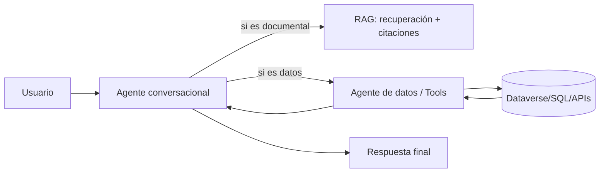

# Sesión 3.3 — Datos estructurados y “agentes de datos”

> **Módulo**: SESIÓN 3 — *Arquitectura híbrida: RAG, herramientas y breve introducción a datos estructurados*  
> **Bloque**: 3.3 Breve apartado: datos estructurados y agentes de datos  
> **Propósito**: introducir (sin profundizar todavía) cómo encajan los **datos estructurados** en una arquitectura híbrida y por qué suele convenir separar un **agente conversacional** de un **agente/dominio de datos**.

---

## 1) Resultados de aprendizaje

Al finalizar este bloque, el participante podrá:

1. Explicar la diferencia entre **conocimiento no estructurado** (RAG) y **datos estructurados** (tablas/registros).
2. Entender por qué Dataverse se usa como repositorio de datos y cómo se integra desde Copilot Studio.
3. Reconocer el patrón “**agente de datos**” y su separación de responsabilidades.
4. Aplicar criterios de decisión (visión general) para escoger entre:
   - RAG documental,
   - consulta de datos estructurados,
   - flujo híbrido.

> Nota: En el módulo específico de datos estructurados se profundizará en diseño de tablas, seguridad (RLS), límites y rendimiento.


---

## 2) Conocimiento no estructurado vs datos estructurados

### 2.1 Conocimiento no estructurado (RAG)

**Qué es**
- Documentos, PDFs, páginas web, wikis, correos, políticas, procedimientos.

**Cómo se usa**
- chunking → embeddings → recuperación → generación → citación.

**Qué preguntas resuelve bien**
- “¿Qué dice la política sobre X?”
- “Resume el procedimiento Y.”
- “¿Cuáles son los pasos para…?”
- “Compara A y B en este manual.”

**Qué preguntas resuelve mal**
- “¿Cuál es el estado exacto de mi pedido?”
- “Dame los 10 clientes con mayor facturación este mes.”
- “¿Cuántos tickets tengo abiertos hoy?”

---

### 2.2 Datos estructurados (tablas, registros)

**Qué es**
- Filas y columnas: cuentas, pedidos, tickets, empleados, inventario.
- Relaciones, claves, estados, fechas, importes.

**Cómo se usa en un agente**
- una consulta (Dataverse/SQL/API) devuelve datos exactos,
- el LLM **no inventa**; solo interpreta y presenta.

**Qué preguntas resuelve bien**
- “¿Cuál es mi saldo de vacaciones?”
- “¿Qué pedidos tengo pendientes?”
- “Lista tickets abiertos por prioridad.”
- “¿Cuántos registros cumplen X condición?”

**Riesgo**
- intentar “pasar la tabla entera” al LLM: caro y peligroso.  
  La arquitectura correcta es: **consulta → resumen/selección → respuesta**.

---

## 3) Dataverse como fuente estructurada (visión general)

### 3.1 Qué aporta Dataverse en un entorno corporativo
- Modelo de datos con tablas, relaciones y roles.
- Gobernanza y seguridad del entorno Power Platform.
- Integración natural con Power Apps / Power Automate / Dynamics 365.

### 3.2 Formas habituales de integrar Dataverse con Copilot Studio (visión general)

> Dependiendo del caso, Dataverse puede usarse como:
> 1) **conocimiento** (RAG sobre datos indexados/buscables) o  
> 2) **fuente estructurada** (consulta de filas/registro).

#### A) Dataverse como conocimiento “tipo RAG”
- El agente puede usar datos como “enterprise knowledge” bajo ciertas capacidades del producto.
- Útil para: respuestas tipo “insights” y explicaciones a partir de información de negocio.

**Cuándo NO usarlo**  
- cuando necesitas exactitud de campo en tiempo real y/o filtros complejos.

#### B) Dataverse como fuente estructurada mediante herramientas
- Usar:
  - **conector de Dataverse** como herramienta, o
  - **agent flow** (Power Automate) que consulta Dataverse y devuelve un JSON compacto.

**Ventajas**
- Controlas exactamente qué campos devuelves.
- Puedes aplicar reglas, filtros, paginación y seguridad.

---

### 3.3 Principios de diseño de consultas para conversación

1) **Trae poco, pero correcto**
- 5–20 filas relevantes, no 5.000.
- Campos necesarios: estado, fecha, owner, importe… no el registro completo.

2) **Siempre devuelve IDs**
- Si muestras algo, incluye su identificador para acciones posteriores.

3) **Paginar**
- En conversación, lo útil es: “te muestro los 10 más relevantes; ¿quieres ver más?”

4) **Preparar “deltas”**
- Si el usuario pregunta “¿qué ha cambiado desde ayer?”  
  → la query debería calcular el cambio, no el LLM.

5) **Separar consulta de narrativa**
- La herramienta devuelve datos; el LLM redacta.

---

## 4) Concepto de “agente de datos”

### 4.1 Definición didáctica
Un **agente de datos** es una componente (o sub‑agente) especializada en:
- transformar preguntas a consultas estructuradas (o seleccionar queries predefinidas),
- ejecutar la consulta en el sistema de datos,
- devolver resultados **estructurados y controlados**.

El **agente conversacional**:
- gestiona diálogo, desambiguación, tono,
- decide cuándo llamar al agente de datos,
- integra el resultado con explicaciones y (si aplica) RAG documental.

---

### 4.2 Por qué separar responsabilidades

**Beneficios**
- **Seguridad**: el agente de datos opera bajo políticas de acceso controladas.
- **Fiabilidad**: evita que el LLM “interprete” datos sin control.
- **Mantenibilidad**: cambias la lógica de consulta sin reescribir toda la conversación.
- **Escalabilidad**: puedes tener múltiples agentes de datos por dominio (RRHH, ITSM, Finanzas).

**Señal de que necesitas separación**
- múltiples sistemas (CRM + ERP + HRIS),
- reglas de seguridad complejas,
- alto impacto si hay error (finanzas, legal, operaciones).

---

### 4.3 Arquitectura de referencia (simplificada)



---

## 5) Criterios de decisión arquitectónica (visión general)

### 5.1 Preguntas guía (para decidir rápido)

1) **¿La información cambia con frecuencia?**  
   - Sí → Tool/Data
2) **¿La respuesta exige exactitud de campo?**  
   - Sí → Data (consulta), no RAG
3) **¿Hay personalización por usuario?**  
   - Sí → Tool/Data con identidad/permisos
4) **¿Hay una política/procedimiento asociado?**  
   - Sí → Híbrido (RAG + Data)
5) **¿Necesitas citaciones?**  
   - Sí → RAG (y/o enlazar a registro/ID en datos)
6) **¿Cuántos registros podrían devolver?**  
   - Muchos → query + agregación + paginación

---

### 5.2 Mini‑casos (para discusión)

**Caso A — RRHH**  
“¿Cuántos días de vacaciones me quedan y cómo se calculan?”  
- Arquitectura esperada: **Data (saldo) + RAG (regla)**

**Caso B — ITSM**  
“¿Qué significa P2 y cuál es el SLA?”  
- Arquitectura esperada: **RAG** (documental)  
  (opcional: Data si el SLA depende de contrato/cliente)

**Caso C — Ventas**  
“Dame los 5 clientes con mayor crecimiento este trimestre.”  
- Arquitectura esperada: **Data** (consulta agregada) + narrativa del LLM

---

## 6) Cierre

Mensaje clave:
> RAG es excelente para *explicar* y *citar* conocimiento.  
> Los datos estructurados son mejores para *medir*, *listar*, *filtrar* y *actuar con precisión*.  
> En empresa, la solución robusta suele ser **híbrida** y con separación de responsabilidades.

---

## Referencias oficiales (lectura opcional)

```text
Copilot Studio — Conectores como herramientas (visión general):
https://learn.microsoft.com/en-us/microsoft-copilot-studio/advanced-connectors

Copilot Studio — Añadir herramientas a agentes (tipos: connectors, flows, prompts):
https://learn.microsoft.com/en-us/microsoft-copilot-studio/add-tools-custom-agent

Dataverse MCP con Copilot Studio (interacción NL con datos; introducción):
https://learn.microsoft.com/en-us/power-apps/maker/data-platform/data-platform-mcp-copilot-studio

Power Platform release plan — Dataverse como enterprise knowledge en Copilot Studio (contexto):
https://learn.microsoft.com/en-us/power-platform/release-plan/2025wave1/data-platform/add-dataverse-as-enterprise-knowledge-copilot-studio
```
