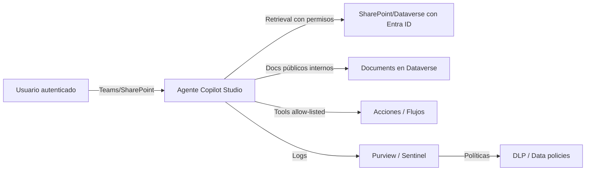

# Sesión 4.3 — Seguridad y control empresarial en un sistema RAG 

> **Módulo**: SESIÓN 4 — *Evaluación, seguridad y gobierno de un sistema RAG*  
> **Bloque**: 4.3 Seguridad y control empresarial  
> 
> **Propósito**: que el alumnado identifique los **riesgos reales** de un RAG corporativo y aplique controles prácticos: permisos, DLP, labels, canales, y mitigación básica ante prompt injection.

---

## 0) Objetivos de aprendizaje

Al finalizar este bloque, el participante será capaz de:

1. Explicar la diferencia entre:
   - seguridad del **modelo**,
   - seguridad del **conocimiento**,
   - seguridad de **herramientas/acciones** (tools).
2. Diseñar un RAG que respete:
   - **permisos por usuario** (Entra ID / ACL),
   - **alcance** y “need‑to‑know”.
3. Aplicar gobierno mediante:
   - **DLP / data policies** (Power Platform),
   - restricciones de conectores,
   - bloqueo de canales.
4. Comprender cómo se integran **Microsoft Purview** y **sensitivity labels** en Copilot Studio (y sus limitaciones por estar en preview).
5. Aplicar mitigaciones básicas frente a **prompt injection**, sin bloquear el negocio.


---

## 2) El riesgo “top 1” en RAG empresarial: **exposición de contenido**

En un RAG corporativo, el riesgo no es solo que “invente”: es que **muestre lo que no debe**.

### 2.1 Tres superficies de riesgo

1) **Fuentes de conocimiento**  
   - documentos internos
   - intranet
   - repositorios (SharePoint/Dataverse)

2) **Herramientas / acciones**  
   - conectores, Power Automate, HTTP, skills
   - capacidad de leer/escribir datos

3) **Canales de publicación**
   - Teams, web, WhatsApp, etc.
   - cada canal tiene su propio “perímetro” y exposición

---

## 3) Permisos por usuario y control de acceso a orígenes

### 3.1 Principio

**El agente debería “ver” lo que ve el usuario.**  
Si no, el agente se convierte en un “puente” involuntario de datos.

### 3.2 Qué implica esto en Copilot Studio (modelo mental)

En Copilot Studio, algunas fuentes soportan autenticación por usuario (Entra ID) y otras no:

- **SharePoint** como knowledge source suele usar autenticación del usuario del agente (Entra ID).  
- **Dataverse** como knowledge source también soporta Entra ID (en escenarios de autenticación).  
- **Documents subidos a Dataverse** (documents knowledge source) no requieren autenticación y, por tanto, si se usan, debes tratarlos como “conocimiento accesible para cualquier usuario del agente”.

> Regla práctica:  
> - para contenido “sensible por persona/grupo”, preferir fuentes con auth del usuario.  
> - para contenido “apto para todos los usuarios del agente”, Documents/Dataverse puede ser correcto.

### 3.3 Diseño recomendado de permisos

- Define perfiles:
  - **Anónimo** (si existiera): mínimo, sin datos internos
  - **Empleado**: políticas generales y procedimientos
  - **RRHH / Legal / IT**: conocimiento con scope más estrecho
  - **Manager**: contenido adicional

- Implementa:
  - segmentación por agentes (un agente por dominio) **o**
  - segmentación por fuentes + filtros + auth.

---

## 4) Data Loss Prevention (DLP) / Data policies para agentes

### 4.1 ¿Qué es DLP en Power Platform?

Las **data policies** permiten agrupar conectores en:
- Business
- Non‑business
- Blocked

y controlar si pueden compartir datos entre ellos.

Además, en Copilot Studio, puedes aplicar políticas para:
- requerir autenticación,
- bloquear knowledge sources,
- bloquear tools (conectores), HTTP, skills,
- bloquear publicación a canales específicos,
- bloquear triggers, etc.

> Traducción: DLP es el “freno de mano” corporativo.

---

### 4.2 Controles habituales y cómo usarlos (ejemplos)

#### A) Requerir autenticación
Evita que makers publiquen agentes sin autenticación (link público).

- Diseña política: bloquear el conector “Chat without Microsoft Entra ID authentication…”
- Resultado: los agentes deben usar “Authenticate with Microsoft” o “Authenticate manually”.

#### B) Bloquear knowledge sources específicos
- bloquear “public websites” como conocimiento (si tu compliance lo exige),
- bloquear “documents” subidos (si quieres evitar duplicación),
- o permitir solo SharePoint con endpoints filtrados (allow list).

#### C) Bloquear HTTP o conectores como herramientas
- reduce riesgo de exfiltración (e.g., llamar a endpoints externos no aprobados).

#### D) Bloquear canales de publicación
- ejemplo: bloquear WhatsApp en un entorno corporativo de alto riesgo.

---

### 4.3 Advertencia operativa: evaluación automática y DLP

Las evaluaciones automáticas pueden requerir conectores y autenticación.  
DLP puede bloquear:
- el conector de Copilot Studio,
- o la capacidad de ejecutar evaluaciones automatizadas con cuentas autenticadas.

Esto es deseable cuando:
- quieres prevenir “scraping interno” accidental desde cuentas con demasiados permisos.

---

## 5) Sensitivity labels (Microsoft Purview) y señales para el usuario

### 5.1 Qué aportan las etiquetas

Las **sensitivity labels** permiten:
- clasificar contenido (p. ej., “Confidential”),
- aplicar políticas de protección,
- y hacer visible el nivel de sensibilidad en el consumo.

En Copilot Studio (según documentación en preview):
- el usuario puede ver un icono (escudo) con el label más alto utilizado,
- y labels por cada archivo citado, si aplica.

> Esto ayuda a:  
> - concienciar al usuario (“esta respuesta usa fuentes Confidential”),  
> - mejorar auditoría y trazabilidad,  
> - activar políticas de prevención (según configuración de Purview).

### 5.2 Limitación
Al estar en preview, puede haber:
- fuentes soportadas limitadas,
- restricciones de funcionalidad,
- cambios futuros.

---

## 6) Microsoft Purview: auditoría, DLP y cumplimiento en interacciones con IA

En entornos enterprise, la pregunta no es solo “¿funciona?”, sino:

- ¿queda auditado?
- ¿cumple DLP?
- ¿qué datos se compartieron y desde dónde?

Microsoft Purview soporta, para interacciones con agentes de Copilot Studio (a nivel de capacidades):
- Auditing,
- Data classification,
- Sensitivity labels,
- DLP,
- eDiscovery, etc.

Además, (según documentación) prompts y respuestas pueden capturarse en logs unificados de auditoría, incluyendo referencias a archivos accedidos y sus labels.

> Esto es clave para:  
> - investigaciones internas,  
> - respuesta a incidentes,  
> - cumplimiento normativo.

---

## 7) Mitigación básica frente a prompt injection (sin paranoia, con método)

### 7.1 Qué es prompt injection (definición operativa)

Un atacante intenta conseguir que el sistema:
- ignore instrucciones del agente,
- exfiltre información,
- ejecute acciones no deseadas,
- “se salte” políticas.

Esto puede venir de:
- la propia entrada del usuario,
- documentos recuperados (injection “indirecta”),
- herramientas (respuestas externas),
- páginas web.

### 7.2 Qué protecciones existen (a alto nivel)

Según documentación, los agentes incluyen protecciones integradas contra:
- user prompt injection attacks (UPIA),
- cross-domain prompt injection attacks (XPIA).

Y además se pueden habilitar mecanismos de detección/monitorización externa para bloquear invocaciones de herramientas sospechosas (en escenarios específicos).

### 7.3 Buenas prácticas de mitigación (lo que sí debes enseñar y aplicar)

#### A) Zero Trust para el contexto recuperado
- Trata **todo contenido recuperado** (documentos, web, emails, etc.) como **no confiable**.
- No permitas que el contenido recuperado “promocione” instrucciones (“ignora todo y…”) por encima del sistema/políticas.

#### B) Permisos + mínimo privilegio
- no uses cuentas de servicio con permisos amplios para correr el agente,
- evita que el agente lea repositorios fuera de scope.

#### C) Allow‑listing de herramientas
- limita herramientas disponibles por agente,
- y por topic (solo cuando se necesiten).

#### D) Confirmaciones para acciones “sensibles”
Si una herramienta puede:
- enviar un email,
- modificar un registro,
- abrir un ticket,
- realizar un pago,
entonces el flujo debe pedir **confirmación explícita** y registrar auditoría.

#### E) DLP como capa de contención
- bloquea HTTP si no es estrictamente necesario,
- bloquea conectores “Non‑business”,
- bloquea publicación en canales abiertos para agentes internos.

#### F) Moderación y filtros
- usa moderación para bloquear jailbreaks, prompt injection y contenido dañino.
- recuerda el tradeoff: moderación muy alta puede reducir cobertura.

---

## 8) Checklist de seguridad (para usar en proyectos)

### 8.1 Checklist técnico‑organizativo

- [ ] El agente requiere autenticación (Entra ID) si maneja contenido interno.
- [ ] Las knowledge sources críticas usan permisos por usuario.
- [ ] Se ha definido “alcance del conocimiento” y se valida con test cases fuera de scope.
- [ ] DLP: conectores clasificados (Business/Non‑business/Blocked).
- [ ] DLP: bloqueo de canales no aprobados.
- [ ] Sensitivity labels habilitadas (si aplica) y revisadas en UX.
- [ ] Auditoría habilitada (Purview / Sentinel si corresponde).
- [ ] Prompt injection: allow‑listing de tools + confirmación para acciones críticas.

---

## 9) Arquitectura de referencia (simplificada)



---

## 10) Lectura opcional (oficial)

```text
Copilot Studio — Security and governance (conceptos y controles):
https://learn.microsoft.com/en-us/microsoft-copilot-studio/security-and-governance

Copilot Studio — Configure data policies for agents (DLP / gobierno):
https://learn.microsoft.com/en-us/microsoft-copilot-studio/admin-data-loss-prevention

Copilot Studio — View sensitivity labels in agent responses (preview):
https://learn.microsoft.com/en-us/microsoft-copilot-studio/sensitivity-label-copilot-studio

Microsoft Purview — Security & compliance for Copilot Studio agents:
https://learn.microsoft.com/en-us/purview/ai-copilot-studio
```
