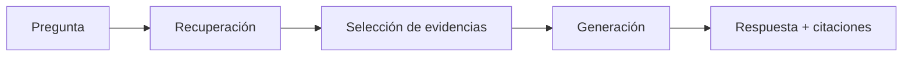

# Sesión 4.4 — Citaciones y trazabilidad en RAG

> **Módulo**: SESIÓN 4 — *Evaluación, seguridad y gobierno de un sistema RAG*  
> **Bloque**: 4.4 Citaciones y trazabilidad  
> 
> **Propósito**: que el alumnado entienda **cómo funcionan las citaciones**, sus limitaciones en Copilot Studio y cómo diseñar respuestas con **abstención responsable** y trazabilidad útil para auditoría.

---

## 1) Objetivos de aprendizaje

Al finalizar este bloque, el participante será capaz de:

1. Explicar el rol de la citación como “evidencia” (no como adorno).
2. Diagnosticar fallos típicos de citación:
   - irrelevantes,
   - duplicadas,
   - ausentes,
   - “se citó bien pero se respondió mal”.
3. Conocer limitaciones comunes:
   - canal (ej. Teams) y respuestas personalizadas,
   - citaciones no reutilizables como inputs de herramientas,
   - particularidades de fuentes (custom data, web search, etc.).
4. Diseñar plantillas de respuesta con:
   - citación por afirmación,
   - formato claro,
   - y abstención responsable cuando no hay evidencia.

---

## 2) Función de las citaciones: evidencia, trazabilidad y confianza

En un sistema RAG, la citación cumple tres funciones:

1) **Evidencia**  
   - “¿De dónde sale esto?”

2) **Trazabilidad**  
   - auditoría y debugging (qué fuente influyó)

3) **Confianza**  
   - el usuario puede verificar y abrir la fuente

> En entornos corporativos, una citación es una “pista forense”: si falta, el sistema se vuelve opaco.

---

## 3) Cómo se generan citaciones (modelo mental)

### 3.1 Flujo típico



La citación suele apuntar a:
- documento y URL,
- ubicación (página, sección, etc.),
- o, en algunos casos, a un “ContentLocation” definido por la fuente.

---

### 3.2 Citaciones en “Custom data” (nodo generative answers)

Cuando aportas datos a un generative answers node mediante una tabla (custom data), típicamente:

- `Content`: texto que se usa para responder
- `ContentLocation`: URL para la citación
- `Title`: título opcional para la citación

**Implicación práctica**
- Si no defines `ContentLocation`, podrías perder trazabilidad (o tener citación pobre).
- Si defines `Title`, ayudas a UX (citaciones legibles).

> Limitación importante: solo se usan los **primeros 3 registros** de la tabla para generar la respuesta.  
> Esto impacta en cobertura y citaciones si intentas pasar mucha evidencia.

---

### 3.3 Prioridad de fuentes (topic vs agent level)

En Copilot Studio, las fuentes a nivel de **generative answers node** pueden tener prioridad sobre las del agente, y las del agente actúan como “fallback”.

Implicación:
- si estás depurando citaciones, revisa primero qué fuentes aplica el nodo del topic.
- cuidado con pensar que “el agente busca en todo”; puede estar limitado por el nodo.

---

## 4) Limitaciones relevantes (para decirlas explícitamente en clase)

### 4.1 Citaciones en Teams cuando personalizas la respuesta

Si configuras un generative answers node para **no enviar el mensaje directamente** (p. ej. para capturar la respuesta y luego renderizarla tú), hay canales donde:

- las citaciones no se renderizan automáticamente
- y debes incluir el renderizado explícito (o usar el modo “sin personalización”)

> Traducción para el alumnado:  
> “si manipulas la respuesta, revisa que el canal muestre citaciones como esperas”.

---

### 4.2 Citaciones no reutilizables como inputs para herramientas

Hay escenarios donde las citaciones devueltas por una fuente:
- **no pueden usarse como entradas** para otras herramientas/acciones.

Esto rompe diseños tipo:
- “si citó el documento X → ejecuta una acción con ese enlace”.

Solución típica:
- extraer o reconstruir la referencia (ID/URL) con metadatos propios,
- o diseñar un “mapping” documento‑ID para automatización.

---

### 4.3 Citación y “general knowledge” / web

Si habilitas que el agente use “conocimiento general” del modelo o búsquedas web amplias:
- puedes perder el carácter “estrictamente citado” de las respuestas
- o mezclar evidencias con conocimiento no trazable

> Recomendación: para agentes corporativos, desactivar “general knowledge” salvo casos muy controlados.

---

### 4.4 Limitación operacional: gobernar citaciones “no es solo UX”

Incluso con citaciones, si:
- hay documentos duplicados,
- hay versiones antiguas,
- hay PDFs con extracción defectuosa,
entonces la citación puede ser técnicamente correcta pero *operativamente mala*.

Esto enlaza con:
- versionado,
- dedupe,
- metadatos,
- y alcance del conocimiento.

---

## 5) Buenas prácticas de citaciones y trazabilidad

### 5.1 Diseñar respuesta “auditable”

Formato recomendado:

1) Respuesta breve (1–3 frases)
2) Detalle en bullets
3) Nota de limitación (si aplica)
4) Citaciones claras (1–3, no 10)

**Ejemplo**

> **Respuesta**: Puedes trasladar hasta 5 días al año siguiente si tu manager lo aprueba.  
> **Detalles**:  
> - Debe solicitarse antes del 15 de diciembre.  
> - No aplica a contrataciones temporales.  
> **Fuentes**: (citaciones)

---

### 5.2 Citar por afirmación (no al final)

Mala práctica:
- 1 citación al final para 10 afirmaciones

Buena práctica:
- cada bloque/afirmación importante tiene respaldo.

---

### 5.3 Manejar contradicciones (dos documentos dicen cosas distintas)

Patrón recomendado:
- decirlo explícitamente,
- citar ambas fuentes,
- proponer criterio (versión más reciente, documento “oficial”, etc.),
- o pedir confirmación a un owner.

---

## 6) Abstención responsable: diseño de respuestas cuando no hay evidencia

La abstención no es “no responder”; es **responder de forma segura**:

### 6.1 Plantillas recomendadas

#### A) No hay evidencia suficiente
- “No encuentro información en las fuentes configuradas para responder con certeza.”
- “¿Puedes indicar país/unidad/versión del proceso?”
- “Si lo deseas, puedo buscar en [fuente X] si la añadimos.”

#### B) Pregunta fuera de alcance
- “Este agente está diseñado para (X). Tu pregunta parece pertenecer a (Y).”
- “Te recomiendo consultar (canal/proceso).”

#### C) Evidencia incompleta
- “En el documento aparece (A), pero no encuentro (B).”
- “Puedo darte (A) con citación; para (B) necesito…”

---

### 6.2 Cómo evaluarlo
En evaluación, trata “abstención adecuada” como un objetivo medible:
- ¿abstiene cuando debería?
- ¿evita “rellenar” con suposiciones?
- ¿pide aclaración útil?

---

## 7) Checklist final (para usar en proyectos)

- [ ] ¿Cada respuesta importante incluye citación(s) relevantes?
- [ ] ¿Las citaciones son pocas, limpias y no duplicadas?
- [ ] ¿Las fuentes citadas son las correctas (versión, país, policy vigente)?
- [ ] ¿La UX del canal renderiza citaciones (Teams/Web/etc.)?
- [ ] ¿Hay abstención responsable cuando no hay evidencia?
- [ ] ¿Existe trazabilidad interna (logs, IDs, doc_id/version_id)?

---

## 8) Lectura opcional (oficial)

```text
Custom data en generative answers (ContentLocation/Title y limitación de 3 registros):
https://learn.microsoft.com/en-us/microsoft-copilot-studio/nlu-generative-answers-custom-data

Knowledge sources summary (auth por usuario, límites, y nota sobre citaciones como inputs):
https://learn.microsoft.com/en-us/microsoft-copilot-studio/knowledge-copilot-studio

Generative answers node (nota sobre citaciones en Teams si personalizas):
https://learn.microsoft.com/en-us/microsoft-copilot-studio/nlu-boost-node
```
