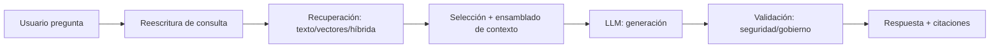

# Sesión 1.1 — Arquitectura RAG en entorno empresarial

> **Bloque**: Sesión 1 — *Fundamentos operativos de RAG y su aplicación inicial en Copilot Studio*  
> **Nivel**: intermedio (orientado a implementación)  
> **Formato recomendado**: explicación guiada + debate + mini‑ejercicio de diseño

---

## 0) Objetivos de aprendizaje del bloque

Al finalizar este bloque, el participante será capaz de:

1. Explicar por qué en entornos empresariales se separa **modelo** (LLM) de **conocimiento** (documentos/datos).
2. Describir el **flujo operativo RAG** y ubicar en qué punto se generan las **citaciones**.
3. Diferenciar **RAG básico, híbrido y conversacional**, y reconocer cuándo conviene cada uno.
4. Identificar factores críticos corporativos: **versionado documental**, **permisos** y **alcance del conocimiento** (scope).

---

## 2) Conceptos base

### 2.1 Separación entre **modelo** y **conocimiento**

**Idea central**: el LLM no “sabe” tu información corporativa (o no debería depender de ello); la empresa controla el conocimiento mediante repositorios, índices y políticas.

- **Modelo (LLM)**  
  - Aporta: comprensión del lenguaje, redacción, síntesis, razonamiento aproximado.
  - Riesgos: “alucinación”, sesgos, datos desactualizados, respuestas no verificables.
  - Limitación operativa: no tiene acceso nativo a documentación interna a menos que se le provea contexto (RAG) o herramientas.

- **Conocimiento (Knowledge)**  
  - Son **fuentes controladas**: políticas internas, procedimientos, manuales, SharePoint, Dataverse, webs corporativas, etc.
  - Aporta: exactitud, trazabilidad, actualización y gobierno (versiones, permisos, auditoría).

**Beneficios empresariales de la separación**
- **Control y gobierno**: cambias un documento y el sistema lo “aprende” tras reindexar, sin reentrenar el modelo.
- **Seguridad**: el acceso al conocimiento puede respetar permisos por usuario (cuando la fuente lo soporta).
- **Trazabilidad**: puedes exigir citaciones o enlaces a la fuente.
- **Coste**: reentrenar modelos es caro; indexar documentos y recuperar fragmentos es relativamente económico.

**Antipatrón típico**: “Pegar el contenido en el prompt”  
- No escala.
- No respeta permisos.
- No deja auditoría real de qué parte del documento sustentó la respuesta.

---

### 2.2 Flujo operativo: recuperación → generación → citación

#### Flujo clásico (conceptual)

1. **Consulta del usuario**
2. **Recuperación (Retrieval)**: búsqueda en el repositorio/index (texto, vectores o híbrida)
3. **Construcción de contexto**: selección de fragmentos (chunks) y metadatos
4. **Generación (Generation)**: el LLM redacta la respuesta usando el contexto recuperado
5. **Citaciones (Citations)**: se adjuntan referencias a los fragmentos/documentos utilizados

#### Flujo típico *industrial* (más realista)

En la práctica, se suelen añadir pasos para robustez, especialmente en productos “enterprise”:

- **Reescritura de consulta (query rewriting)**: el sistema optimiza/expande la pregunta antes de buscar (por ejemplo, incluyendo señales del contexto conversacional).
- **Reranking**: una segunda fase reordena resultados para maximizar relevancia.
- **Validación de seguridad y gobierno**: filtros (DLP/etiquetas) y moderación.
- **Composición de respuesta**: decisión sobre formato, tono, niveles de detalle, etc.

#### Ejemplo visual (pipeline)

**¿Por qué la citación es parte del flujo, no “un extra”?**
- En empresa, “**¿de dónde sale esto?**” es requisito (compliance, auditoría, calidad).
- La citación reduce la ansiedad del usuario y permite verificación.
- Facilita detectar desalineación: si la citación es irrelevante, el problema suele estar en recuperación/chunking/metadata.

---

## 3) Tipologías relevantes de RAG

> **Nota didáctica**: estas categorías no son mutuamente excluyentes; se combinan.

### 3.1 RAG básico (Vector‑first / Retriever + LLM)

**Estructura mínima**
- Documentos → chunking → embeddings → índice vectorial
- Query → embedding → top‑k → prompt con contexto → respuesta

**Pros**
- Implementación rápida.
- Funciona bien con lenguaje natural, sin necesidad de keywords exactas.

**Contras**
- Puede fallar en:
  - términos exactos (códigos, números, acrónimos raros),
  - preguntas que requieren coincidencia literal (“¿cuál es el código exacto?”),
  - diferencias sutiles entre versiones.

**Cuándo usarlo**
- FAQs internas, manuales, políticas, soporte a usuarios, onboarding.

---

### 3.2 RAG híbrido (Vector + keyword/BM25 + reranking)

**Qué añade**
- Además de similitud semántica (vectores), se añade una **búsqueda léxica** (keyword/BM25).
- Se fusionan rankings (por ejemplo mediante Reciprocal Rank Fusion) y opcionalmente se aplica **semantic reranking**.

**Por qué es importante en empresa**
- Los usuarios preguntan mezclando lenguaje natural con:
  - nombres de sistemas,
  - códigos de producto,
  - nomenclaturas internas,
  - identificadores (“INC‑1234”, “POL‑RRHH‑07”).
- La búsqueda exclusivamente vectorial puede recuperar textos “parecidos” pero no los correctos.

**Cuándo usarlo**
- Sistemas donde **precisión** importa (políticas, legal, ITSM, operaciones) y hay lenguaje mixto semántico + exacto.

---

### 3.3 RAG conversacional (Chat‑aware RAG)

**Qué añade**
- El sistema utiliza el historial (p. ej., “los últimos N turnos”) para:
  - resolver correferencias (“eso”, “lo anterior”, “esa política”),
  - completar el contexto (“en el caso de España…”, “para el rol de manager…”),
  - mantener coherencia (seguir la misma fuente/versión si procede).

**Riesgo**
- Si el historial introduce ambigüedad o suposiciones erróneas, puede empeorar la recuperación.
- Se debe controlar **qué** parte del historial se usa y **cómo**.

**Cuándo usarlo**
- Asistentes internos con conversaciones largas donde se construye el contexto progresivamente.

---

## 4) Factores críticos en entornos corporativos

### 4.1 Versionado documental (y “verdad vigente”)

Problema frecuente:
- Hay múltiples versiones de un procedimiento (borrador, en revisión, publicado).
- El asistente puede recuperar fragmentos de una versión antigua y responder mal.

Buenas prácticas (arquitectura + operación)
- **Identificador estable** por documento (DocId) + **VersionId**.
- Metadatos “vigencia”: `valid_from`, `valid_to`, `status` (draft/approved/published).
- Política de recuperación:
  - por defecto: **solo published**,
  - posibilidad de modo experto: incluir draft con advertencia.

Patrón útil: **“Latest‑only retrieval”**
- Si hay varias versiones con el mismo DocId, solo recuperar la más reciente **publicada**.

---

### 4.2 Permisos (seguridad por usuario)

En empresa, el RAG es tan seguro como su integración con:
- autenticación (quién es el usuario),
- autorización (qué puede ver),
- filtrado de resultados (qué se devuelve).

Patrones de control
- **Autorización en la fuente**: SharePoint/Graph devuelve solo lo que el usuario puede ver.
- **Filtrado por metadatos**: la búsqueda aplica filtros por `department`, `classification`, `role`.
- **Seguridad a nivel de chunk**: cuando un mismo documento tiene secciones con diferentes niveles de sensibilidad (más complejo).

Checklist mínimo
- ¿El agente hace retrieval con credenciales del usuario?
- ¿Hay escenarios donde el agente “salta” permisos (p. ej., archivos subidos a un repositorio común)?
- ¿Qué ocurre con el contenido exportado o cacheado?

---

### 4.3 Alcance del conocimiento (scope)

Una de las causas nº1 de “respuestas malas” es un scope mal definido.

Errores típicos
- “Metemos todo SharePoint y ya está”.
- Mezclar dominios (RRHH + IT + Legal) sin separación.
- No decidir qué es “fuente de verdad”.

Buenas prácticas de diseño de alcance
- Definir:
  - **dominio** (tema),
  - **audiencia** (quién),
  - **objetivo** (para qué),
  - **fuentes autorizadas** (qué repositorios),
  - **exclusiones** (qué NO se consulta).
- Diseñar una **taxonomía** mínima (departamento, país, proceso, producto).
- Empezar pequeño: *un caso de uso, un corpus controlado*, y crecer.

---

## 5) Mini‑actividad (8 minutos): “Arquitectura RAG del caso”

### Instrucciones (para grupos de 2–3)
1. Elegid un caso de uso corporativo:  
   - soporte IT interno,  
   - políticas de RRHH,  
   - procedimientos de calidad,  
   - manual de producto.
2. Dibujad el flujo RAG y marcad:
   - fuentes,
   - estrategia de permisos,
   - cómo gestionáis versiones,
   - si necesitáis RAG básico/híbrido/conversacional.
3. Preparad una explicación de 60 segundos.

### Plantilla rápida (copiar/pegar)
- **Caso de uso**:  
- **Usuarios objetivo**:  
- **Fuentes de conocimiento**:  
- **Permisos**: (por usuario / por rol / público interno)  
- **Versionado**: (cómo se decide la “verdad vigente”)  
- **Tipo de RAG**: (básico / híbrido / conversacional + por qué)  
- **Riesgos**: (alucinación, leakage, scope)  
- **Mitigaciones**: (citaciones, filtros, governance)

---

## 6) Preguntas de verificación (para cerrar)

- ¿Qué ventaja aporta separar modelo y conocimiento en una empresa?
- ¿En qué punto del pipeline “nace” una citación y qué la puede estropear?
- ¿Por qué el RAG híbrido suele ser mejor con códigos, nombres propios y acrónimos?
- ¿Qué políticas pondrías para evitar usar versiones antiguas de documentos?

---

