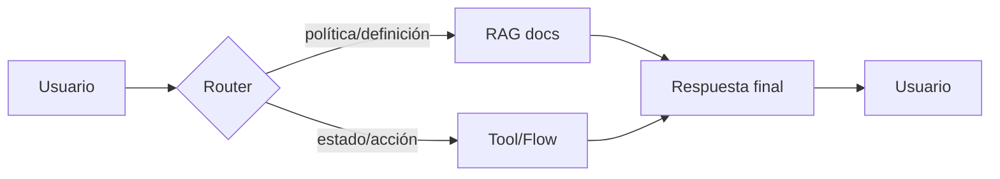

# Sesión 3.4 — Ejercicio práctico: integrar una herramienta y diseñar un flujo híbrido

> **Módulo**: SESIÓN 3 — *Arquitectura híbrida: RAG, herramientas y breve introducción a datos estructurados*  
> **Bloque**: 3.4 Ejercicio práctico  

> **Objetivo**: practicar la integración de una herramienta sencilla, comparar un flujo **RAG vs Tool**, y terminar con un diseño de arquitectura híbrida del caso.

---

## 0) Resultados de aprendizaje

Al finalizar el ejercicio, el participante será capaz de:

1. Añadir una **tool** (flow o connector) a un agente en Copilot Studio.
2. Definir inputs/outputs mínimos para que la tool sea usable en conversación.
3. Comparar resultados del agente cuando usa:
   - solo RAG documental
   - una herramienta (consulta/acción)
4. Documentar un diseño de arquitectura híbrida (RAG + Tool + respuesta final).

---

## 1) Preparación (antes de empezar)

### Requisitos mínimos
- Acceso a un agente en Copilot Studio.
- Permisos para añadir herramientas (Tools).
- (Opcional) acceso a un entorno con Dataverse y una tabla de ejemplo.

### Material recomendado
- Un documento sencillo para RAG (p. ej., “Guía de soporte IT” con definiciones de severidad y SLAs).
- Una herramienta que devuelva datos “vivos” (aunque sea simulado).

> Si no tienes acceso a Dataverse: usa el “Track A” (flow demo) y simula datos en el flow.


---

## 3) Track A (rápido y universal): añadir un agent flow como tool

> Este track prioriza “que funcione” en cualquier entorno para aprender el patrón.  
> El ejemplo más común es un flow que devuelve un dato (p. ej., “pronóstico del tiempo”) para demostrar orquestación y contrato input/output.

### 3.1 Crear (o usar) un flow invocable por el agente
- Crea un flow con trigger tipo **When an agent calls the flow**.
- Define inputs simples (por ejemplo `location`).
- Devuelve un JSON con campos `data` y `summary` (ver ejemplo en Sesión 3.2).

> Si ya tienes un flow publicado, úsalo.

### 3.2 Añadir el flow al agente como herramienta
1) En Copilot Studio, abre tu agente.
2) Ve a **Tools**.
3) Selecciona **Add a tool** y elige **Flow**.
4) Selecciona tu flow (publicado) y agrega/configura conexión si lo pide.
5) Guarda.

### 3.3 Prueba (chat)
- Pregunta: “¿Cuál es el pronóstico para Madrid hoy?” (o tu caso de demo)
- Observa:
  - si el agente llama al flow,
  - qué responde,
  - cómo presenta la información.

**Criterio de éxito**
- La respuesta contiene el resultado del flow y no inventa valores.

---

## 4) Track B (orientado a empresa): tool que consulta Dataverse (búsqueda/filtrado)

> Este track es el puente hacia “datos estructurados”: el agente consulta registros y luego explica.

### 4.1 Preparar una tabla de ejemplo (si aplica)
Ejemplo de tabla `TicketsDemo` (campos sugeridos):
- `TicketId` (texto, único)
- `Status` (opciones)
- `Priority` (opciones)
- `OwnerTeam` (texto)
- `UpdatedAt` (fecha/hora)
- `ShortDescription` (texto)

Carga 10–20 filas de prueba.

### 4.2 Crear un flow: “Buscar ticket por ID”
**Inputs**
- `ticketId` (texto)

**Acciones**
- Acción Dataverse: buscar fila por `TicketId` (o “Search rows” si lo prefieres)
- Parsear JSON si devuelves lista
- Construir salida compacta:
  - si encuentra: `data.ticketId`, `data.status`, `data.updatedAt`, etc.
  - si no encuentra: error de negocio “not_found”

**Outputs**
- `data` (objeto) + `summary` (texto)

### 4.3 Añadir como tool y probar
- Pregunta: “¿Cuál es el estado del ticket TCK-0007?”
- Esperado:
  - el agente llama al flow,
  - devuelve estado real del registro,
  - hace una respuesta clara y verificable.

---

## 5) Comparación guiada: flujo RAG vs Tool (15 min)

### 5.1 Caso de comparación sugerido (IT interno)

**Documento RAG (guía)**
- define severidades P1/P2
- define SLA por severidad
- define procedimiento de escalado

**Tool**
- consulta estado de ticket (o simula el estado)

### 5.2 Preguntas para probar

1) “¿Qué significa una severidad P1?”  
   - **Esperado**: RAG con citación (definición documental).

2) “¿Cuál es el estado de mi ticket TCK-0007?”  
   - **Esperado**: Tool (dato vivo). Si intentas RAG, fallará o inventará.

3) “Mi ticket TCK-0007 es P1; ¿cuál es el SLA y qué hago ahora?”  
   - **Esperado**: Híbrido:
     - Tool → estado del ticket y severidad
     - RAG → SLA/procedimiento
     - Respuesta final combinada

### 5.3 Plantilla de evaluación rápida

| Pregunta | Pipeline usado | ¿Respuesta correcta? | ¿Verificable? | ¿Cita documento? | Comentario |
|---|---|---:|---:|---:|---|
| P1 | RAG |  |  |  |  |
| P2 | Tool |  |  | N/A |  |
| P3 | Híbrido |  |  |  |  |

---

## 6) Diseño de arquitectura híbrida del caso (12 min)

### 6.1 Entregable (1 página)

Completa:

- **Caso de uso**:
- **Usuarios**:
- **Fuentes documentales (RAG)**:
- **Herramientas / sistemas (Tools)**:
- **Datos estructurados (si aplica)**:
- **Criterios de ruteo** (cuándo RAG, cuándo Tool, cuándo ambos):
- **Seguridad**:
  - autenticación (¿quién es el usuario?),
  - autorización (¿qué puede ver/hacer?),
  - minimización (¿qué campos se exponen?).
- **Manejo de errores**:
  - input inválido,
  - no encontrado,
  - timeout,
  - sin permisos.
- **UX conversacional**:
  - preguntas de aclaración,
  - confirmación antes de acciones,
  - mensajes de fallback.

### 6.2 Diagrama (rápido)



---

## 7) Puesta en común (3 min)

Cada grupo comparte:
- 1 decisión de ruteo (por qué),
- 1 riesgo (seguridad o fiabilidad),
- 1 mitigación.

---

## 8) Cierre

Mensaje clave:
> El salto de “RAG” a “RAG + Tools” es lo que convierte un copiloto en un **agente útil** en empresa:  
> entiende políticas (RAG), consulta estado real (datos), y ejecuta acciones (tools) con control.

---

## Referencias oficiales (lectura opcional)

```text
Copilot Studio — Llamar un agent flow desde un agente (ejemplo paso a paso):
https://learn.microsoft.com/en-us/microsoft-copilot-studio/advanced-use-flow

Copilot Studio — Usar agent flows (visión general):
https://learn.microsoft.com/en-us/microsoft-copilot-studio/advanced-flow

Copilot Studio — Devolver una lista de resultados (ejemplo con Dataverse en flow):
https://learn.microsoft.com/en-us/microsoft-copilot-studio/advanced-flow-list-of-results

Copilot Studio — Añadir herramientas a agentes (conectores, flows, prompts):
https://learn.microsoft.com/en-us/microsoft-copilot-studio/add-tools-custom-agent
```
