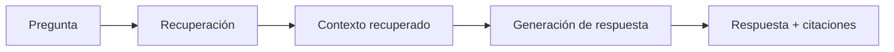

# Sesión 4.1 — Evaluación de calidad en sistemas RAG 

> **Módulo**: SESIÓN 4 — *Evaluación, seguridad y gobierno de un sistema RAG*  
> **Bloque**: 4.1 Evaluación de calidad  
> **Propósito**: que el alumnado se lleve un **marco de evaluación práctico** para diagnosticar *dónde* falla un RAG (recuperación vs respuesta) y *cómo* medirlo de forma repetible.

---

## 0) Objetivos de aprendizaje

Al finalizar este bloque, el participante será capaz de:

1. Diferenciar con claridad:
   - **Evaluación de recuperación (retrieval)** vs
   - **Evaluación de respuesta (generation)**.
2. Definir y aplicar métricas clave:
   - **Precision / Recall**
   - **Relevancia**
   - **Groundedness** (respuesta sustentada en evidencias)
   - **Abstención adecuada** (cuándo NO responder).
3. Diseñar un **dataset de prueba (test set)** con cobertura realista (preguntas fáciles/difíciles, ambigüedad, fuera de alcance).
4. Conectar síntomas observables (citaciones malas, respuestas incompletas, etc.) con causas probables (chunking, scope, permisos, etc.).

---

## Plan completo de la sesión (5 horas)

> Esta SESIÓN 4 está diseñada para **300 minutos** totales (incluye pausas cortas).  
> Ajusta los descansos según el ritmo del grupo.

| Bloque | Tema | Duración |
|---|---|---:|
| 4.1 | Evaluación de calidad (marco y métricas) | 75 min |
| — | **Pausa** | 10 min |
| 4.2 | Evaluación en Copilot Studio (hands-on) | 80 min |
| — | **Pausa** | 10 min |
| 4.3 | Seguridad y gobierno (DLP, labels, canales, prompt injection) | 75 min |
| — | **Pausa** | 10 min |
| 4.4 | Citaciones y trazabilidad (limitaciones + buenas prácticas) | 40 min |
| — | Cierre + Q&A | 0–10 min |

---
## 1) Agenda minuto a minuto

- **00:00–00:08** — Por qué evaluar: “sin medición no hay mejora”.
- **00:08–00:20** — Dos evaluaciones diferentes: retrieval vs respuesta (y por qué se confunden).
- **00:20–00:35** — Métricas de recuperación: precision/recall@k, hit-rate, MRR (conceptual).
- **00:35–00:55** — Métricas de respuesta: relevancia, groundedness, completitud, abstención.
- **00:55–01:10** — Diseño de datasets de prueba: estructura, casos límite, mantenimiento.
- **01:10–01:15** — Mini‑ejercicio: construir 10 test cases con etiquetas (y detectar riesgos).

---

## 2) La idea clave: evaluar **dos sistemas**, no uno

Un RAG en producción es (simplificando) dos sistemas en cadena:



Si el usuario se queja de “el bot responde mal”, pueden pasar *dos cosas muy distintas*:

- **Fallo de recuperación**: el contexto recuperado es incorrecto/incompleto.  
  → Aunque el LLM “genere bien”, no hay buena materia prima.

- **Fallo de respuesta**: el contexto era bueno, pero el LLM:
  - no lo usa,
  - lo sintetiza mal,
  - añade contenido no sustentado,
  - no abstiene.

> **Diagnóstico rápido**: mira primero las citaciones/fragmentos recuperados. Si están mal, no sigas evaluando “la redacción”.

---

## 3) Evaluación de recuperación (retrieval)

### 3.1 ¿Qué significa “recuperar bien”?

Para cada pregunta del dataset, queremos que el retriever traiga (idealmente):

- el **chunk correcto**, o
- un conjunto pequeño de chunks donde **está la evidencia**.

Aquí aparecen dos niveles de “verdad”:

1) **Ground truth documental**: qué documento/sección contiene la respuesta correcta.  
2) **Ground truth de chunk** (más fino): qué fragmentos exactos deberían aparecer en el top‑k.

---

### 3.2 Métricas clásicas (adaptadas a RAG)

> En entornos corporativos, la métrica que más se usa es “**¿aparece la evidencia en top‑k?**”, porque el LLM necesita evidencia.

#### A) Precision@k

De los k resultados recuperados, ¿cuántos son relevantes?

- **Precision@k = (# relevantes en top‑k) / k**

Interpretación:
- alta precision@k → poco ruido (mejor para groundedness).
- baja precision@k → el LLM recibe ruido y puede inventar.

#### B) Recall@k

De todos los documentos/fragmentos relevantes, ¿cuántos aparecen en top‑k?

- **Recall@k = (# relevantes en top‑k) / (# relevantes totales)**

Interpretación:
- alto recall@k → el sistema suele encontrar la evidencia.
- bajo recall@k → el sistema “no encuentra lo que debe”.

#### C) Hit‑rate@k (muy práctica)

¿Está *al menos un* fragmento relevante en top‑k?

- **Hit‑rate@k = 1 si hay ≥1 relevante en top‑k, si no 0**  
- Se reporta como promedio: “% de preguntas con evidencia”.

#### D) MRR (Mean Reciprocal Rank)

Premia que el primer resultado relevante aparezca pronto:

- Para cada pregunta: **RR = 1 / (posición del primer relevante)**  
- **MRR = promedio de RR**

Interpretación:
- útil cuando el LLM usa poco contexto o limitas k.

---

### 3.3 Qué necesitas para medir retrieval

Para medir retrieval de verdad, necesitas:

- Pregunta **Q**
- Lista de **chunks relevantes** (o doc/sections relevantes)
- Resultado de retrieval **top‑k**
- Etiquetado: relevante / no relevante

**Plantilla de etiquetado (simple)**

| ID | Pregunta | Doc/Sección “verdad” | Chunk(s) relevantes | k | ¿Aparece evidencia? |
|---|---|---|---|---:|---|
| R1 | … | POL‑RRHH‑07 §3 | chunk_12, chunk_13 | 5 | Sí/No |

---

### 3.4 Patrones de fallo (retrieval)

- **No encuentra nada relevante** (hit‑rate bajo)
  - scope demasiado amplio o demasiado estrecho
  - chunking malo
  - query rewriting pobre
  - permisos/ACL: el usuario “no puede ver” la evidencia
- **Trae cosas “parecidas” pero no correctas** (precision baja)
  - embeddings dominan demasiado (vector‑only)
  - falta búsqueda híbrida
  - metadatos insuficientes (filtrado por país/versión)
- **Trae duplicados** (mucha redundancia)
  - overlap alto
  - duplicidad documental (múltiples versiones o copias)

---

## 4) Evaluación de respuesta (generation)

La respuesta puede fallar aunque retrieval sea correcto.

### 4.1 Criterios de calidad que necesitas mirar

En Copilot Studio, el método “General quality” evalúa (a alto nivel) criterios muy alineados con RAG: **relevance, groundedness, completeness, abstention**.  
Esto es un buen resumen de lo que deberías evaluar, incluso fuera de Copilot Studio.

#### A) Relevancia

- ¿La respuesta contesta la pregunta?
- ¿Se mantiene en el tema?
- ¿Evita divagar?

#### B) Groundedness (fundamentación)

- ¿Lo que afirma está soportado por el contexto recuperado?
- ¿Incluye afirmaciones “nuevas” que no aparecen en fuentes?

> En RAG corporativo, groundedness es “no inventar” y “apoyarse en evidencia”.

#### C) Completitud

- ¿Cubre todos los puntos relevantes?
- ¿Incluye excepciones importantes?

#### D) Abstención adecuada

- ¿Sabe decir “no tengo evidencia”?
- ¿Hace preguntas de aclaración cuando falta información?
- ¿Evita responder con seguridad cuando no debe?

---

### 4.2 Cómo medir groundedness de forma práctica (sin ciencia ficción)

Una forma operacional de evaluar groundedness:

1) Divide la respuesta en afirmaciones (frases).
2) Para cada afirmación, decide:
   - **Soportada** por evidencia (sí/no)
3) Calcula:

- **Groundedness = (# afirmaciones soportadas) / (# afirmaciones totales)**

**Ejemplo**

Respuesta (3 afirmaciones):
1) “Tienes 22 días laborables.” → soportada ✅
2) “En Portugal son 25.” → no soportada ❌ (fuera del documento)
3) “Debes solicitarlo con 10 días.” → soportada ✅

Groundedness = 2/3 = 0,67

---

### 4.3 Qué necesitas para medir respuesta

Tienes dos caminos (pueden convivir):

**A) Expected answer (respuesta esperada)**  
- Ideal para:
  - preguntas con respuesta “concreta”
  - respuestas cortas (códigos, números, definiciones)

**B) Rubric (rúbrica de evaluación)**  
- Ideal para:
  - preguntas abiertas
  - respuestas con varios formatos válidos
  - evaluación de groundedness y abstención

**Mini‑rúbrica sugerida (0–2 por criterio)**

| Criterio | 0 | 1 | 2 |
|---|---|---|---|
| Relevancia | No responde | Responde parcial | Responde directo |
| Groundedness | Inventos claros | Alguna suposición | Todo sustentado |
| Completitud | Falta lo esencial | Falta algún matiz | Completa |
| Abstención | Responde sin evidencia | Duda poco | Abste/aclára |

Total (0–8).

---

## 5) Importancia de datasets de prueba (test sets)

### 5.1 Por qué un “dataset” cambia el juego

Sin dataset:
- “probamos 3 preguntas” y creemos que está bien.
- no se detectan regresiones al cambiar fuentes o prompts.

Con dataset:
- puedes medir antes/después,
- detectar mejoras reales,
- comparar configuraciones (A/B),
- identificar gaps.

---

### 5.2 Qué debe contener un buen test set (mínimo viable)

Recomendación para empezar:
- 30–50 preguntas para un caso de uso.
- 5 categorías (mezcladas):

1) **Directas** (respuesta literal en el documento)
2) **Paráfrasis** (sinónimos)
3) **Exact match** (códigos, números)
4) **Ambiguas** (deben pedir aclaración)
5) **Fuera de alcance** (deben abstener)

---

### 5.3 Cómo mantener el dataset (operación real)

- Versiona el dataset (v1, v2…)
- Marca preguntas que dependen de documentos/versiones
- Cuando cambie una política, actualiza:
  - la fuente (doc)
  - el expected/rubric
  - la etiqueta de versión

---

## 6) Mini‑ejercicio (5 min)

### Consigna
En parejas, construid 10 test cases para un asistente de “Política de viajes”.

Incluid:
- 4 directas
- 2 paráfrasis
- 2 exact match (si hay importes)
- 1 ambigua
- 1 fuera de alcance

### Plantilla
| ID | Pregunta | Tipo | Evidencia esperada (doc/sección) | ¿Debe abstener? |
|---|---|---|---|---|
| T1 | … | directa | … | No |
| T2 | … | ambigua | … | Sí (pedir dato) |
| T3 | … | fuera alcance | — | Sí |

---

## 7) Notas del instructor

- Repite este mensaje: **“Evalúa primero retrieval, luego respuesta.”**
- Introduce el concepto de “**evidencia**” como requisito (citaciones).
- Evita convertir la evaluación en “opiniones”. Usa rúbricas y test sets.

---

## 8) Lectura opcional (oficial)

> URLs en bloque de código para fácil acceso.

```text
Copilot Studio — About agent evaluation:
https://learn.microsoft.com/en-us/microsoft-copilot-studio/analytics-agent-evaluation-intro

Copilot Studio — Choose evaluation methods (relevance/groundedness/completeness/abstention):
https://learn.microsoft.com/en-us/microsoft-copilot-studio/analytics-agent-evaluation-overview
```